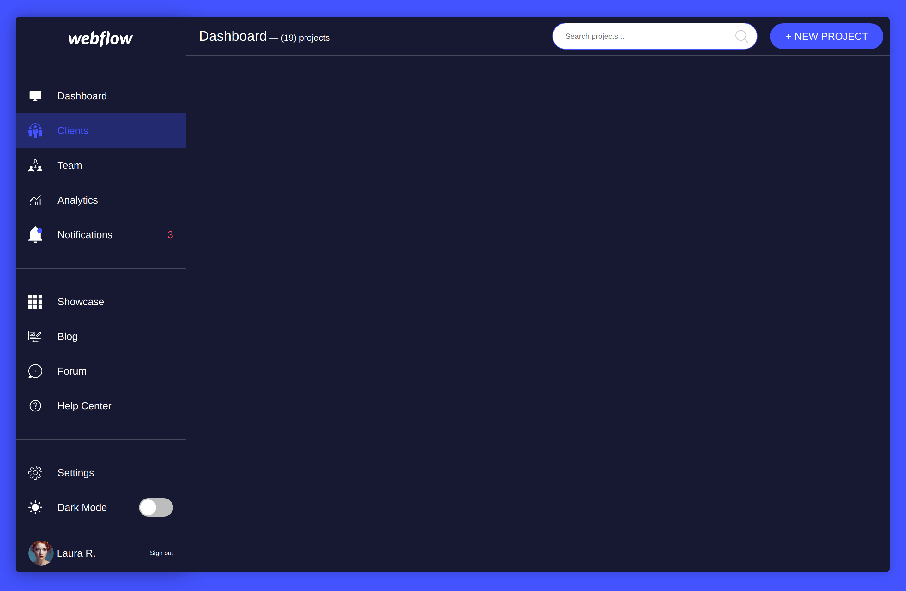

# Webflow Mac App

Тестовое задание по вёрстке HTML + CSS.

[Страница на GitHub Pages](https://gvozdenkov.github.io/ui-challenge-dashboard/)

## Описание

1. CSS стили написаны по [БЭМ](https://ru.bem.info/methodology/css/)
2. Переключение светлой / тёмной темы
